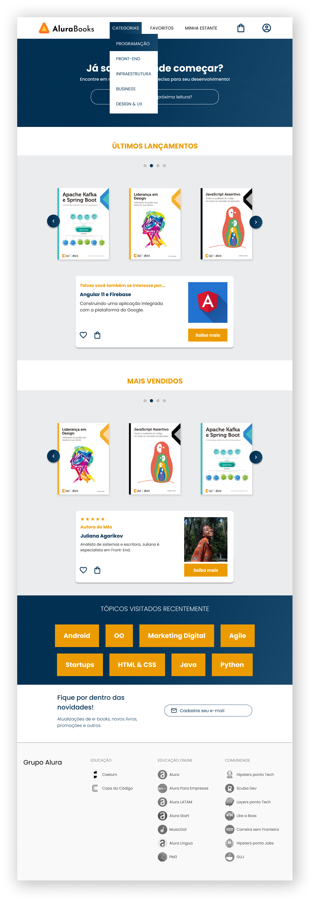
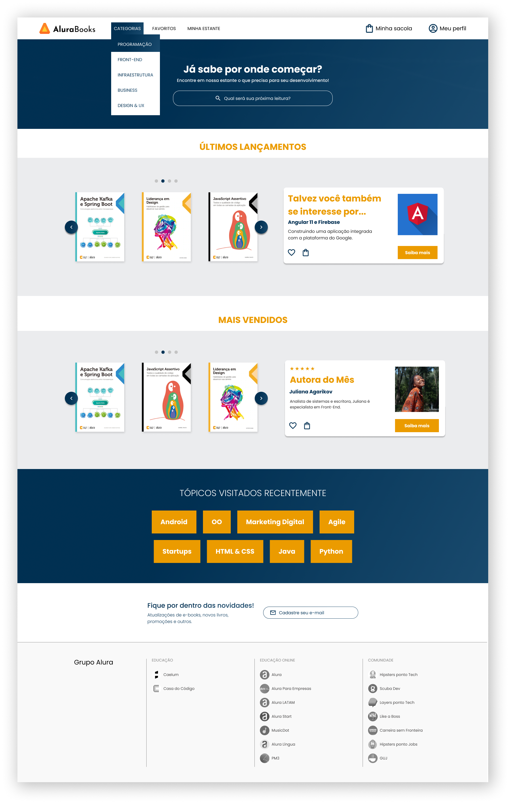

# Olá! Bem vindo ao projeto Alura Books!

Projeto desenvolvido utilizando responsividade com mobile-first - layouts de 428px (mobile), 1024px (tablet) e 1728px (desktop):

  <figure style="display: inline-block; text-align: center; margin: 2px;">
    
  </figure>
  <figure style="display: inline-block; text-align: center; margin: 2px;">
    
  </figure>
  <figure style="display: inline-block; text-align: center; margin: 2px;">
    
  </figure>

## Ferramentas utilizadas:

* HTML

* CSS

* Flex-box

* Figma

* Mobile First

## Feito por:

### Vitória de Camargo

### Linkedin: https://www.linkedin.com/in/vpaesi/
